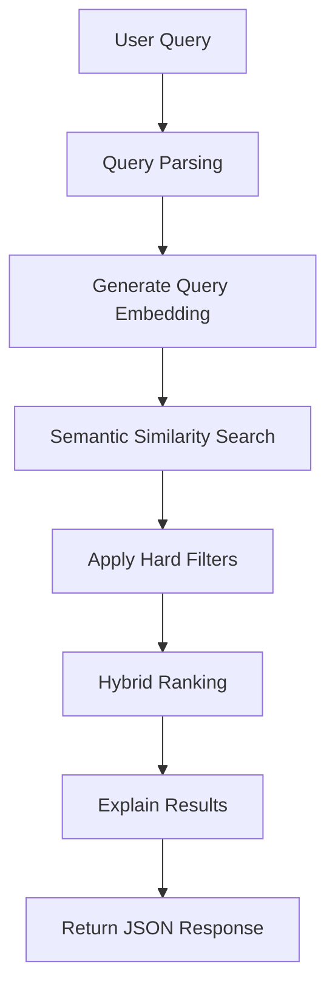

# AI Product Search Engine

## Project Overview

Here is my solution for the AI Product Search Engine take-home assignment. It accepts natural language queries and uses a hybrid approach (combining semantic similarity, keyword matching, and business rules) to find and rank the most relevant products. Everything runs from an in-memory index, and the API actually explains its reasoning for why it ranked each product the way it did.

## Features

- **Semantic Search**: Uses `@xenova/transformers` (`Xenova/all-MiniLM-L6-v2` model) in-process to understand natural language intent.
- **Natural Language Filtering**: Extracts price constraints (e.g., "under 5000") and categories automatically.
- **Hybrid Ranking**: Combines Semantic Similarity (70%), Keyword Matching (20%), and Business Logic (10%).
- **Reasoning Engine**: Explains why a product matched (e.g., "Strong semantic match", "Price within budget").
- **Multiple Data Sources**: Loads from JSON or CSV depending on the `.env` configuration.
- **In-Memory Indexing**: Fast retrieval with pre-computed embeddings at startup.

## Architecture

I organized the codebase using a layered approach to keep things clean and modular:
- **Routes**: Define HTTP endpoints (`/api/search`, `/api/health`).
- **Controllers**: Handle HTTP requests/responses and extract parameters.
- **Services**: Contain core business logic (`product.service`, `embedding.service`, `ranking.service`, `search.service`).
- **Data Access**: `productLoader.service` handles ingesting JSON/CSV into memory.
- **Utils**: Helper functions for text parsing and math (Cosine Similarity).

## Search Flow Diagram



## Tech Stack

- **Runtime**: Node.js
- **Framework**: Express.js
- **Language**: TypeScript
- **AI/ML**: `@xenova/transformers` (Local Embeddings)
- **Validation**: Zod
- **Utilities**: `csv-parse`

## Setup

This project is split into a backend search API (`athena`) and a frontend web interface (`athena-ui`).

### 1. Backend (API)
```bash
cd athena

# Install dependencies
npm install

# Start development server (runs on port 3000)
npm run dev
```

### 2. Frontend (UI)
```bash
cd athena-ui

# Install dependencies
npm install

# Start development server
npm run dev
```
## Environment Variables

Create a `.env` file in the root directory:

```env
PORT=3000
# Can be 'json' or 'csv'
DATA_SOURCE=json 
```

## Running the Application

1. Make sure Node.js is installed.
2. Run `npm run dev`.
3. The first time the application starts, it will download the embedding model to a local cache (approx. 80MB). Wait for the log: `[INFO] ... - Product index initialized with 32 products`.
4. The server will start on port 3000.

## API Documentation

### Health API
```http
GET /api/health
```

### Search API
```http
GET /api/search?q=gaming keyboard under 5000
```

## Sample Requests & Responses

### 1. Gaming keyboard under ₹5000

**Request**: `GET /api/search?q=gaming%20keyboard%20under%205000`

**Response (Partial)**:
```json
{
  "query": "gaming keyboard under 5000",
  "filters": {
    "keywords": ["gaming", "keyboard"],
    "maxPrice": 5000
  },
  "results": [
    {
      "id": "1",
      "title": "Redgear Mechanical Keyboard",
      "description": "Budget RGB mechanical gaming keyboard with clicky blue switches.",
      "category": "keyboard",
      "price": 3999,
      "score": 0.8123,
      "reasons": [
        "Strong semantic match",
        "Matches keyboard category",
        "Price is within the specified budget"
      ]
    },
    {
      "id": "28",
      "title": "Logitech G213 Prodigy",
      "description": "RGB membrane gaming keyboard with dedicated media controls.",
      "category": "keyboard",
      "price": 3995,
      "score": 0.7951,
      "reasons": [
        "Strong semantic match",
        "Matches keyboard category",
        "Price is within the specified budget"
      ]
    }
  ]
}
```

### 2. Budget mechanical keyboard

**Request**: `GET /api/search?q=budget%20mechanical%20keyboard`

**Response (Partial)**:
```json
{
  "query": "budget mechanical keyboard",
  "filters": {
    "keywords": ["budget", "mechanical", "keyboard"]
  },
  "results": [
    {
      "id": "1",
      "title": "Redgear Mechanical Keyboard",
      "description": "Budget RGB mechanical gaming keyboard with clicky blue switches.",
      "category": "keyboard",
      "price": 3999,
      "score": 0.8250,
      "reasons": [
        "Strong semantic match",
        "Matches keyboard category"
      ]
    },
    {
      "id": "25",
      "title": "Ant Esports MK1000",
      "description": "Very cheap tenkeyless mechanical keyboard for budget gamers.",
      "category": "keyboard",
      "price": 1999,
      "score": 0.7600,
      "reasons": [
        "Strong semantic match",
        "Matches keyboard category"
      ]
    }
  ]
}
```

## Ranking Strategy

To get the best results, I built a hybrid scoring model that normalizes values between 0 and 1:
`finalScore = (0.70 * semanticSimilarity) + (0.20 * keywordScore) + (0.10 * businessScore)`

1. **Semantic Similarity**: Cosine similarity between the query embedding and product embedding (Title + Description + Category).
2. **Keyword Score**: Ratio of query keywords that appear in the product title, description, or category.
3. **Business Score**: A cumulative boost given for:
   - Strong semantic match (> 0.6)
   - Category exact match
   - Price satisfying the budget filter
   - Exact title match

## Assumptions

- Products are in English.
- Dataset size is small to medium (fitting comfortably in memory).
- Search index is kept in memory and regenerated at startup.
- Product popularity data is unavailable for ranking.
- Currency is INR.
- Single-user/demo application (startup blocking for embeddings is acceptable).

## Trade-offs

- **In-process ML**: Using `@xenova/transformers` increases the memory footprint and adds startup latency but removes the need for external APIs (like OpenAI) or separate vector databases.
- **In-memory Search**: A linear scan over all embeddings is performed for each search. This is fine for < 10,000 products, but it is $O(N)$ and not suitable for millions of products.
- **Simple NLP**: Regex is used instead of a dedicated NLU model to parse prices (e.g. "under 5000"). It's fast and lightweight but less robust to edge cases.

## Error Handling

- Uses global Express error handler middleware.
- Zod validates query parameters. If `q` is missing, it returns `400 Bad Request` with `{"message": "Search query is required"}`.
- If JSON or CSV files are invalid or missing at startup, the app gracefully throws an error and exits to prevent running in a corrupted state.

## Testing Instructions

### Testing the API
1. Open a terminal and navigate to the backend directory: `cd athena`
2. Run `npm run build` to check for TypeScript compilation errors.
3. Start the server: `npm run dev`.
4. Try standard queries using `curl` or the provided `athena/test.http` file (if using VS Code REST Client):
   ```bash
   curl "http://localhost:3000/api/search?q=Gift%20cards%20for%20PlayStation"
   curl "http://localhost:3000/api/search?q=Wireless%20gaming%20mouse"
   curl "http://localhost:3000/api/search?q=Affordable%20monitor"
   ```
5. To test CSV loading, change `.env` to `DATA_SOURCE=csv`, restart the server, and it will work exactly the same.

### Testing the Web Interface (UI)
1. Ensure the backend is running (`cd athena && npm run dev`).
2. Open a second terminal and navigate to the frontend directory: `cd athena-ui`.
3. Start the Vite development server: `npm run dev`.
4. Open your browser and navigate to `http://localhost:5173` to use the visual search interface.
5. **Testing with the larger dataset**: The server starts with a small 5-item test dataset. I've included `sample-dataset.json` and `sample-dataset.csv` in the project root. You can upload either of these via the frontend UI's upload section to dynamically re-index and test the full catalog.

## Future Improvements

- **Vector Databases**: Offload embedding storage and similarity search to Pinecone, pgvector, or Milvus for sub-millisecond retrieval on large datasets.
- **Distributed Indexing**: Shift from in-memory processing to an Elasticsearch/OpenSearch cluster.
- **Caching**: Add Redis to cache common search queries and their embeddings.
- **Incremental embedding generation**: Queue-based background processing (RabbitMQ/Kafka) for generating embeddings of new products.
- **LLM-powered query understanding**: Use a lightweight LLM to parse complex user intents instead of regex.
- **Click analytics & Personalization**: Factor in user behavior for re-ranking results.
